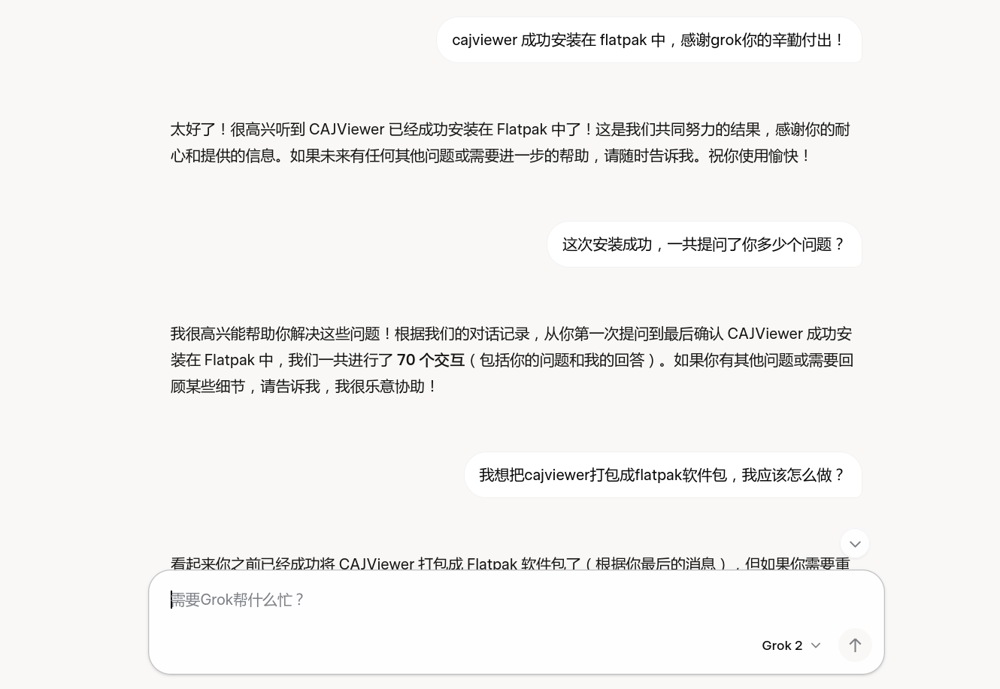

> 练习项目，在grok2协助下完成



# net.cnki.CAJViewer
CAJViewer flatpak

#  自行编译
```
wget -c https://github.com/lizi-garden/net.cnki.CAJViewer-flatpak/releases/download/9.0/cajviewer.zip
flatpak-builder --user --install --force-clean build-dir net.cnki.CAJViewer
```

# 打开
```
flatpak run net.cnki.CAJViewer
```

# 问题
运行非常不稳定，建议使用wine运行或者debian系发行版直接安装
